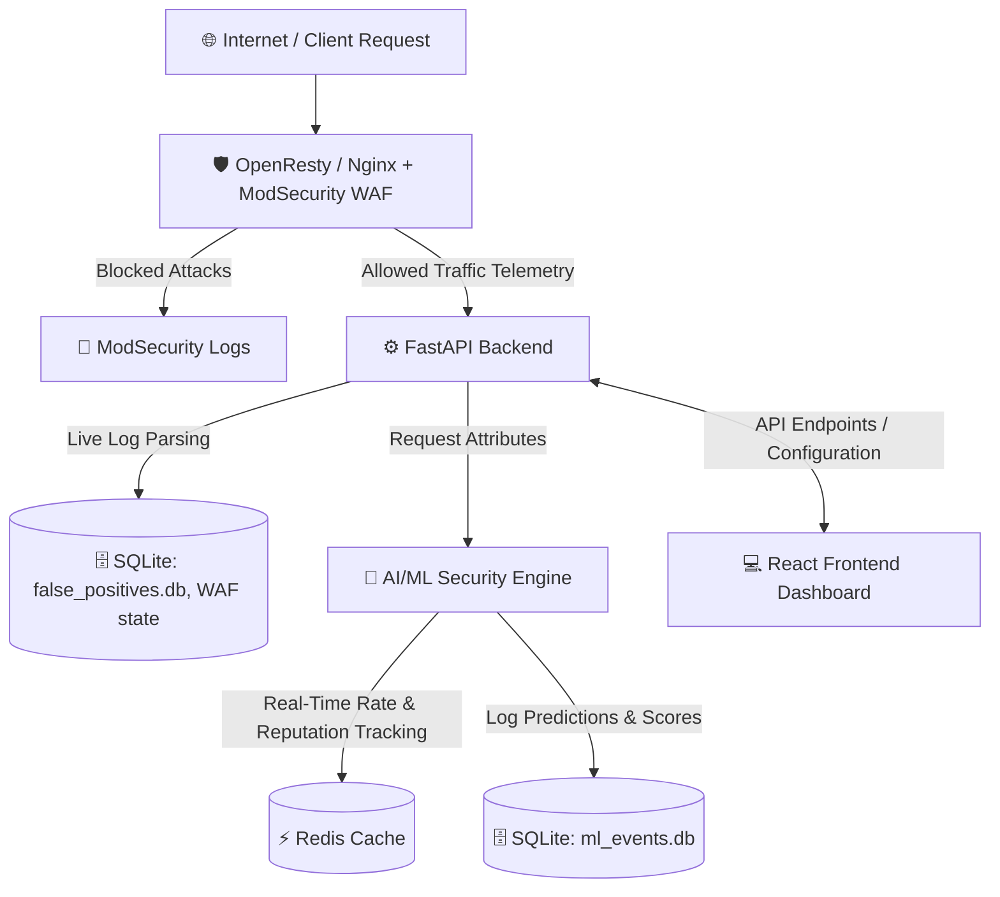

# CyberSentinel WAF (Web Application Firewall)

Welcome to CyberSentinel, an advanced, intelligent Web Application Firewall (WAF) dashboard and security platform. 

Whether you are a system administrator, a security engineer, or a non-technical business manager, this guide will help you understand exactly what CyberSentinel is, how it protects your digital assets, and how the entire system is built and operates.

---

## 🌟 What is CyberSentinel WAF? (The Security Guard Analogy)

Imagine your website or web application is a highly secure building. **CyberSentinel WAF acts as the intelligent security guard standing at the front door.**

Every time a user, a software program, or a search engine tries to visit your website, CyberSentinel checks their credentials and behavior:
* **The Normal Visitor:** If it's a regular user browsing your site, CyberSentinel lets them in instantly with zero delay.
* **The Hacker or Bad Bot:** If someone tries to break in, inject malicious code, guess passwords, or crash the site, CyberSentinel immediately blocks them at the door, shuts down their access, and logs the incident.

---

## 🛡️ Core Security Features

1. **Active Threat Blocking:** Instantly detects and blocks common hacker attacks (such as SQL Injection, Cross-Site Scripting (XSS), and Path Traversal) before they reach your web application.
2. **AI/ML Security Engine:** An intelligent machine-learning layer that analyzes traffic behavior and scores the "threat level" of users to catch new, sophisticated attacks that traditional rules might miss.
3. **DDoS & Bot Mitigation:** Limits request speeds and blocks automated bots that try to overwhelm your server or scrape your website content.
4. **API Protection:** Inspects and assigns a security grade (A to F) to hidden application endpoints (APIs) to ensure background communications are safe.
5. **Web Anti-Defacement (File Integrity):** Monitors files on the server in real-time. If an unauthorized attacker somehow changes the website code, CyberSentinel immediately reverts the file back to its original state and sounds an alarm.
6. **Visual Control Panel:** A clean, responsive dashboard that lets you see live logs, adjust settings, and monitor attack statistics at a glance.

---

## 🏗️ System Architecture & Data Flow

CyberSentinel operates as a multi-layered shield between the public internet and your private application. Here is how the components interact:

### 1. The Gateway (Nginx / OpenResty + ModSecurity)
This is the front gate. When a user requests your website, the request goes through **OpenResty** (a high-performance web server built on Nginx). Inside OpenResty, **ModSecurity** (an open-source WAF engine) inspects the request against the OWASP Core Rule Set (CRS). If the request is malicious, it is blocked immediately.

### 2. The Brains (FastAPI Backend)
The backend is written in **Python (FastAPI)**. It runs in the background and:
* Parses raw WAF and system logs.
* Manages configuration rules, DDoS limits, and settings.
* Exposes secure endpoints that feed data directly to the user dashboard.

### 3. The Visuals (React Frontend)
Built using **Vite, React, and CSS**, this is the user dashboard. It is a premium, responsive control panel that displays live attack logs, security scores, geo-location charts of attackers, and configuration toggles.

### 4. The Smart Layer (AI/ML Engine)
The machine learning engine (`ml-waf`) sits alongside the backend. It uses advanced mathematical models to analyze traffic behavior and calculate threat scores.

---

## 🧠 How the AI/ML Security Engine Works

Traditional firewalls only check if a request contains "bad words" (known signatures). The AI/ML Engine is much smarter: it looks at **behavior**.

### The Math Models:
* **XGBoost Classifier:** A supervised model trained to recognize patterns matching known attack types.
* **Isolation Forest:** An unsupervised model designed to spot "anomalous" traffic (traffic that looks completely different from normal user behavior, which usually indicates a new or custom attack).

### The Decision Loop:
1. **Fetch Behavioral Context:** When a request arrives, the engine grabs the user's speed and past reputation from **Redis**.
2. **Calculate Threat Score:** The engine combines the ModSecurity score, the XGBoost probability, the Isolation Forest anomaly score, and the Redis reputation to output a final **Threat Score (0 to 100%)**.
3. **Decide Action:** If the Threat Score exceeds the configured threshold, the request is flagged or blocked.
4. **Update Reputation:** The engine updates the user's reputation score in Redis.
5. **Periodic Training:** To keep the models accurate, administrators can trigger manual training (typically every 15-20 days). This feeds new, verified normal traffic into the models so they learn the difference between real users (reducing false positives) and true threats.

---

## 🗄️ Database Architecture (Where Data is Saved)

CyberSentinel uses a combination of memory caching and lightweight databases to remain extremely fast and self-contained:

### 1. Redis (In-Memory Database)
Used for **instant, high-speed telemetry tracking**. It acts as the engine's short-term memory:
* **`redis_rpm` (Requests Per Minute):** Counts how fast a specific IP address is sending traffic.
* **`redis_rep` (Reputation Score):** Tracks how many times a specific IP has triggered security rules. If an IP behaves poorly, its reputation score rises. If it behaves well, its bad reputation score decays over time.

### 2. SQLite Databases
Used for **permanent, structured storage**:
* **`ml_events.db`**: Stores all ML logs, threat evaluations, decisions, and scores. This data is used to populate charts and feed future model training sessions.
* **`false_positives.db`**: Stores custom rules and exceptions created by administrators when they flag that an alert was a "false alarm."
* **`waf_gui.db` / `waf_dashboard.db`**: Stores user accounts, dashboard states, and log summaries.

### 3. JSON Configuration File (`settings.json`)
The application core configurations—such as WAF rule adjustments, DDoS settings, whitelist/blacklist IPs, and mail alerts—are stored in a plain text file at `backend/app/config/settings.json`.

---

## 🔑 Login Authentication & Security

To maintain a lightweight footprint without requiring a bulky database engine, login authentication is designed to be **simple, secure, and stateless**:

* **No Dedicated User DB:** User credentials (passwords for the "Admin" and "Analyst" roles) are not stored in a SQL table. Instead, their **secure cryptographical hashes** (using `bcrypt`) are saved directly inside the `settings.json` configuration file.
* **Secure Verification:** When a user logs in via the dashboard, the backend hashes the input password and checks if it matches the hash stored in `settings.json`.
* **Stateless JWT Tokens:** Upon successful login, the backend generates a **JSON Web Token (JWT)**. The user's browser saves this token in `localStorage`. For every future dashboard action, the browser automatically sends this token. The backend verifies the token's validity mathematically, meaning it doesn't need to look up active sessions in a database.
* **Role-Based Access Control:** Users are assigned either an `Admin` role (can modify settings, reload Nginx, turn WAF off) or an `Analyst` role (read-only access to view logs, charts, and statistics).
